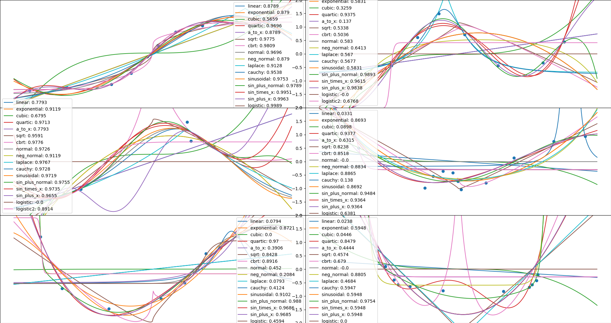

# Auto Curver

This is a drop-in sklearn regressor that fits a collection of curves to data. 
It has competitive performance with other estimators for small, dense, continuous datasets, such as linnerud.



Fitting curves in this manner allows for good models to be produced from small amounts of data, and naturally makes overfitting difficult, as there are at most 8 parameters. 

To extend this method over multi-dimensional input, a single curve is trained for each (X[dimension], y) pair. When predicting, a weighted average is computed, using the r_squared scores for each dimensional curve. 

The AutoCurver class accepts three params:
* *maxfev*, the maximum amount of iterations of the scipy optimizer to try until giving up on convergence. Default 100,000.
* *max_params*, the maximum amount of parameters to allow curves to have. Some curves, like sin_plus_normal, have 8 params. This is enough to overfit very small datasets. Restricting max_params to a smaller number will filter the overly powerful curves.
* *certainty_scaler*, the power to raise the r_squared scores to before computing the weighted average. A larger value will make the estimator more dependent on a few strong dimensions, a value lower than 1 will raise the importance of dimensions with a weak correlation. 


## Fitting AutoCurver on the linnerud dataset:

```
from sklearn.datasets import load_linnerud
X, y = load_linnerud(return_X_y=True)
from sklearn.multioutput import MultiOutputRegressor
from auto_curve import AutoCurver
estimator = MultiOutputRegressor(AutoCurver(max_params=3))
estimator.fit(X, y)
```

The internal curves are stored in the `estimators` variable. 

```
#The estimators of MultiOutputRegressor are stored as a list in .estimators_
print(estimator.estimators_[0].estimators)
```
```
[{'score': 0.022694825834594368, 'params': array([  0.20548074,  54.15820699]), 'f': <function linear at 0x7ffb015ae6a8>}, {'score': 0.050642138800673364, 'params': array([  2.59341100e-02,   5.23252903e+01]), 'f': <function linear at 0x7ffb015ae6a8>}, {'score': 0.001220318829992073, 'params': array([  4.91210652e-03,   5.57546789e+01]), 'f': <function linear at 0x7ffb015ae6a8>}]
```

We see a dictionary of the curve used, it's fitted params, and it's r_squared score.
In this case, every function was linear, with a low r_squared score.
However, the combination the three inaccurate regressions produces a highly accurate prediction.

##Comparison of AutoCurver to Other Techniques

This is a collection of models with their default parameters, and if they are highly accurate, tuned parameters. They are tested on 100 splits of the linnerud dataset.

```
from sklearn.datasets import load_linnerud

X, y = load_linnerud(return_X_y=True)

from sklearn.multioutput import MultiOutputRegressor
from sklearn.svm import SVR
from sklearn.kernel_ridge import KernelRidge
from sklearn.ensemble import RandomForestRegressor, GradientBoostingRegressor
from sklearn.neural_network import MLPRegressor
from auto_curve import AutoCurver
from sklearn.linear_model import LinearRegression

from sklearn.model_selection import train_test_split

import numpy as np

scores = [[], [], [], [], [], [], [], [], [], [], []]

for _ in range(100):  # try many times, since our data is so small
    X_train, X_test, y_train, y_test = train_test_split(X, y)

    for i, estimator in enumerate([
        MultiOutputRegressor(SVR()),
        MultiOutputRegressor(SVR(C=100, epsilon=1)),
        MultiOutputRegressor(GradientBoostingRegressor()),
        MultiOutputRegressor(GradientBoostingRegressor(loss="lad")),
        MultiOutputRegressor(RandomForestRegressor()),
        MultiOutputRegressor(RandomForestRegressor(criterion="mae")),
        MultiOutputRegressor(RandomForestRegressor(criterion="mae", max_features="sqrt")),
        MLPRegressor(),
        KernelRidge(),
        MultiOutputRegressor(AutoCurver(max_params=3)),
        MultiOutputRegressor(LinearRegression())
    ]):
        estimator.fit(X_train, y_train)
        predictions = estimator.predict(X_test)
        error = np.mean(np.abs(predictions - y_test))
        scores[i].append(error)

print(list(np.mean(s) for s in scores))

```

```
[9.8605413913256843, 9.5258908103496189, 12.057710705094756, 10.614211281625316, 10.660599999999999, 10.751799999999998, 10.5464, 40.155177489666613, 43.038677253363893, 8.9282193470412068, 10.420406680864248]
```

So:
1. AutoCurver with max_params of 3 has an accuracy of 8.9
2. The next most accurate model is a SVR with so much regularization it's effectively linear, at 9.5
3. Followed by default SVR, at 9.8
4. Followed by a LinearRegression, at 10.4

With basic tuning, AutoCurver is 6% better then the next best estimator for this problem.


## Caveats

1. AutoCurver is sometimes _incredibly_, _dramatically_ incorrect. There are some functions that produce a spike or discontinuity with some params, and if you get unlucky with your training data, that spike might be right in the middle of where you want a smooth prediction. 
2. Since AutoCurver only looks at one dimension at a time, it is incapable of dealing with sparse or categorical datasets with any accuracy.
3. If you have a large amount of data with a complex pattern, AutoCurver will lose to a more powerful estimator.

But, for small, dense, continous regressions, AutoCurver will do quite well. 
